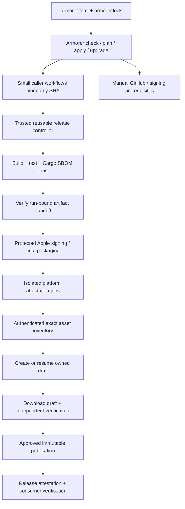

# Armorer architecture proposal

Status: accepted design; implementation is delivered in reviewed slices. Original research verified 2026-09-30; parallel contracts updated 2026-10-01.

Armorer makes secure Rust CI and independently verifiable releases a repeatable repository capability. It configures a project, checks what is actually enforced, and records what has been demonstrated. Installing workflow files alone never means a project has achieved a SLSA level.

Confirmed decisions: public repositories under `brianluby`, MIT license, secure releases fail closed when required capabilities are unavailable, and Momus plus Rusty Brain as pilots. **v0.1 targets Build L2; L3 assessment and gap closure are deferred to the backlog for an unscheduled future version.** Momus implementation continues independently. Architecture discovery did not modify either pilot. The repositories are now provisioned; current implementation status is documented in the README. Release publication requires separate authorization.

## Repository and language boundaries

| Component | Proposed location | Responsibility |
| --- | --- | --- |
| CLI and shared runtime | `brianluby/armorer`; local `/Users/bluby/repos/armorer` | Discovery, typed configuration, previews, safe file changes, migrations, capability checks, release inventory and consumer verification |
| Trusted workflows | `brianluby/armorer-workflows` | Versioned CI/build/release controllers, fixed commands, job permissions, reviewed tool pins, workflow integration fixtures |

Both public repositories are provisioned. Armorer PR #1 merged configuration validation and read-only Cargo discovery; the workflow repository has an MIT/contributor-documentation base for subsequent implementation PRs. Crate-name availability remains a publication-time check, not a reservation. Use original project artwork and describe the forging inspiration in prose. [ADR 0004](docs/adr/0004-parallel-contracts.md) freezes ownership and interfaces for transactional apply, reusable CI and target-aware builders.

Use **Rust** initially, with Clap, Serde, TOML editing that preserves comments, Cargo metadata support, and a small shared core/runtime. Rust provides typed validation, portable binaries, strong filesystem handling and direct alignment with the repositories being configured. Python would accelerate prototyping but add interpreter/dependency distribution to every adopter; shell is unsuitable for transactional migration and robust untrusted-input handling; Go is viable but loses the Cargo ecosystem alignment. Delegate Sigstore cryptographic verification to a pinned GitHub CLI initially rather than implementing a new verifier.

Version the two repositories independently. Each tested workflow release declares supported Armorer config/runtime versions. Consumers pin the workflow to a full commit SHA and record the compatible runtime version/digest. A workflow release pins all helper code and tool distributions it uses; it must not load helper scripts from the consuming repository or fetch a moving branch. One reviewed catalog defines compatible pins. Upgrades change that catalog and consuming pins through reviewable diffs.



## Configuration and bootstrap contract

Use root **`armorer.toml`** for intent, **`armorer.lock`** for resolved compatible versions and SHA/digest pins, and **`.armorer/state.json`** for generated-file bases and ownership. All are versioned in Git; the state file contains no secrets and is never a source of cryptographic trust. Put consumer trust policy in an explicitly reviewed independent document, distributable separately from artifacts. [Proposed ADR 0006](docs/adr/0006-release-trust-contract-versioning.md) freezes the new document as JSON (`armorer-policy.json`) while preserving existing TOML config/lock contracts.

The schema includes:

- Config version, repository identity, profiles and release policy.
- Exact release Rust toolchain; separately declared MSRV CI cases. Do not replace `rust-version` with the release compiler version.
- Explicit deliverables: workspace package, binary or library, target triple, named feature case, default-feature switch, packaging type and signing requirement. Support multiple profiles in one workspace.
- Explicit CI feature cases and package selections. Do not equate `--all-features` with all valid feature combinations.
- Project-owned license/source/bans policy references, advisory exceptions with owner/reason/expiry, and supported built-in test capabilities.
- Builder/runtime/catalog pins in the lock; expected verifier identities and acceptable historical versions in the separate trust policy.

Unknown fields, invalid package/binary names, options disguised as names, parent paths, symlinks escaping the checkout, unrestricted URLs, unsupported runner/target combinations and conflicting feature selections are errors. Resolve workspace-inherited version/license/metadata through Cargo, not text matching the first `version` line. Names are passed as typed argument-array values with fixed flags, never interpolated into shell programs. Unsupported native toolchains or integration services are reported as unsupported capabilities rather than accommodated by an arbitrary `run` input.

Proposed interface:

```text
armorer check [--online] [--json]
armorer plan --profile cli --output armorer-plan.json
armorer apply --plan armorer-plan.json
armorer upgrade --to <reviewed-catalog-version> --output armorer-plan.json
armorer verify --repo <owner/repo> --tag <exact-tag> --policy armorer-policy.json
```

`check` reads configuration, local state and, when requested, GitHub capabilities. `plan` produces a deterministic file/settings preview and manual-action list. Neither builds project code, installs tools, executes repository hooks, or changes remote settings. Discovery uses Cargo metadata without builds; dependency resolution/network activity is explicitly controlled and reported.

`apply` checks the plan version, input config/lock digests and every file preimage, stages changes, acquires a local transaction lock and atomically replaces only approved managed paths. Maintain a recovery journal; fault injection proves rollback or clear resumability. Repeating the same apply is a no-op. Never delete an unknown file. Never turn a permission failure into an assumption that a capability is enabled.

Existing files start unowned. Add separate managed caller workflows where possible; import existing files only through a preview that identifies ownership. Three-way upgrades use the previous generated base, current customized file and new generated file. Conflicts stop changes to the affected transaction. Preserve custom jobs in separate workflows; do not expose custom release shell hooks. Existing `deny.toml`, toolchain and Dependabot entries are merged only through explicit reviewed plans. Dirty unrelated files remain byte-identical. Settings mutations should be a separate opt-in future operation; v0.1 reports exact administrator steps.

## Initial profiles and supported scope

| Profile | CI | First release capability |
| --- | --- | --- |
| Library | Tests/doc tests, MSRV, fmt, Clippy, declared feature cases, dependency/license policy; SemVer check when a supported baseline exists | Verify Cargo package creation and distribute/attest explicit `.crate` archives through GitHub; crates.io publishing is a later adapter |
| CLI | Library gates where applicable plus declared binaries and smoke tests | Fixed-format archives for explicit package/binary/target/feature combinations |
| Service | Workspace gates and declared lifecycle/integration test targets | Executable archives and service smoke-test evidence; deployments and OCI publishing are later adapters |

Initial native targets: `x86_64-unknown-linux-gnu`, `aarch64-unknown-linux-gnu`, `aarch64-apple-darwin`, on supported GitHub-hosted runners. Preserve a documented minimum Linux glibc compatibility target. Add Windows, musl and cross compilation only after a tested builder backend exists. Pin the runner label and record its actual image version; GitHub-hosted images themselves are mutable, so do not claim completely pinned execution or reproducible output.

Release builds use locked dependencies, exact tools, fixed commands and no shared build-output caches. PR caches, if enabled, have separate trust domains and cannot feed release jobs. Downloaded tools require version plus distribution integrity verification or locked source installation. A version string alone is not sufficient. Tool upgrades remain reviewable even when the upstream marks a major tag as stable.

## CI policy beyond SLSA

Default gates: Rust tests/doc tests, fmt, Clippy, RustSec checks and project-specific cargo-deny license/source/bans checks, actionlint, zizmor, and fully redacted secret scanning. Consolidate duplicated advisory checks where possible. An advisory database outage or stale database outside the permitted freshness window blocks releases. A PR may report an outage separately, but must not represent that check as passed. Exceptions are narrow, reviewed and expire.

Additional profile capabilities: cargo-hack for bounded feature testing, cargo-semver-checks for public library compatibility, CodeQL for Rust and Actions where available, and cargo-vet when maintainers can support audit/exemption review. Native dependency inventory and installed-binary auditing need supplementary tools; see RESEARCH.md. Expensive scans belong in scoped/scheduled/manual jobs with honest coverage reports. Scorecard is a diagnostic, not a release-security score or proof.

The [#16 assessment](docs/supply-chain-assessment.md) and proposed [ADR 0005](docs/adr/0005-additional-defenses-and-adapters.md) define optional defense priorities, explicit capability/coverage/exception boundaries, and bounded dist/crates.io adapter requirements for #2. CodeQL Rust no-build analysis still executes build scripts/macros and stays outside check/plan and credentialed release jobs. These optional implementations do not block the v0.1 L2 baseline; registry publication remains a future adapter.

Branch protection/rulesets, workflow CODEOWNERS, required CI checks, review of dependency/tool updates, secret scanning/push protection, SECURITY.md and a vulnerability disclosure process complement artifact integrity. A signed vulnerable binary is still vulnerable.

## Trusted release controller and credentials

Expose `ci.yml`, `release-cli.yml`, `release-library.yml` and `release-service.yml` as public interfaces. Each release controller owns its complete job graph. Avoid a public generic `attest arbitrary artifact` interface or a caller-selected build/attest split. Caller inputs identify a versioned config file and a supported operation; they cannot provide commands, subject digests, arbitrary artifact IDs, custom predicates, claimed source revisions or signer identities.

The controller obtains checkout/source SHA/ref, caller identity, workflow identities and run/attempt identity from the platform. It validates the on-checkout config and derives package selections and expected assets. Provenance claims come from the platform attestation machinery. Additional build/sign evidence is internally generated and independently checked; document fields that remain tenant-produced at L2. Such records do not become stronger just because they are signed.

| Boundary | Permissions/credentials | Repository code execution |
| --- | --- | --- |
| Fork/PR CI | Read-only; no OIDC or signing secrets | Tests/build scripts run here |
| Trusted release build | Contents read; no OIDC, Apple secrets or publication rights | Cargo, dependencies and build.rs run here |
| Build evidence attestation | Contents read, attestations write, id-token write | Trusted pinned helpers only; no Cargo or caller scripts |
| Apple transformation | Caller-scoped protected `release-signing` environment and explicitly named Apple secrets; no publication rights | Trusted pinned signing/packaging code only |
| Final attestation | Contents read, attestations write, id-token write | Trusted pinned helpers only; hashes final local paths itself |
| Capability preflight | Narrow metadata/admin read through an approved App or equivalent; no build/code execution | Trusted helpers only |
| Draft/publication | Contents write in protected publish jobs; no unnecessary OIDC | Trusted helpers only |
| Verification | Read-only access to artifacts/drafts and trusted verifier | No downloaded executable is run before verification |

Caller workflow permissions are an upper bound; grant elevated permissions only on the reusable release call and narrow them again per internal job. Do not use `secrets: inherit`. Environment secrets belong to the consuming repository: prove the effective environment context with a pilot, rather than assuming secrets/protection from the workflow-host repository transfer across repositories. Detect plan limitations for required reviewers and deployment/ref restrictions.

OIDC is limited to trusted release evidence jobs. A later crates.io trusted-publishing adapter needs its own narrowly scoped OIDC job. `artifact-metadata: write` is unnecessary for ordinary file attestations; enable it only for a supported storage-record feature.

Accept only stable release-tag pushes whose commit satisfies the reviewed release-source policy, plus authorized dispatch on the protected default branch for rehearsal. Validate semantic version and package versions, protected ref/ancestry and repository identity. Rehearsals may sign/attest with explicit rehearsal identities but never publish or move tags. Reject PR, fork, `pull_request_target`, `workflow_run`, branch/tag confusion and unsupported dispatch refs before any credentialed step.

## Artifact and evidence contract

Represent artifacts by deliverable ID, package/binary, target, feature case, source commit, config and lock digest, builder workflow/pin, toolchain/tool versions, runner image and run/attempt. Record SHA-256 and size of each output. Asset names must be unique, portable and free of path syntax. A library with zero dependencies is valid: generic SBOM validation cannot require Momus-specific crate names or a nonempty dependency list.

Generate Cargo-aware CycloneDX JSON using the same package, target and feature selection as the build. Validate against a pinned supported schema and check lockfile immutability, component identity, resolvable graph references, package scope and declared feature/target metadata. Fixture projects verify target-only dependencies, dev-only exclusions and build-dependency treatment. Disclose that the resolved Cargo graph is not a linker inventory and does not cover all native/system/downloaded libraries.

For every final distributable:

1. Generate platform SLSA provenance over the **final published bytes**.
2. Generate provenance for its matching published SBOM file.
3. Generate a separate SBOM attestation: final distributable is the subject; its Cargo SBOM is the predicate.
4. Export Sigstore bundles with explicit predicate/subject names and retain API records.

Authenticate the release inventory itself with platform provenance. Inventory lists final archives, SBOMs, checksums and any published transformation evidence with exact hashes/sizes. Produce artifact/SBOM bundles first, then inventory, then inventory attestation; keep the inventory's own authentication bundle outside the inventory to avoid a self-referential hash. All bundle digests already available may be listed. Trusted controller policy derives the required asset set independently and includes the inventory authentication bundle as a required asset.

### macOS build → sign → package

Preserve unsigned executable/archive digests and build evidence. Fetch artifacts by specific run/attempt and artifact identity, verify producer context and independently recompute digests. Do not merge artifacts by glob/name and overwrite the unsigned object. Signing outputs new IDs. Validate bounded archives against traversal, symlinks and unexpected executables before accessing signing credentials.

Record signed executable digest, Developer ID team/certificate identity, pinned signing workflow/runtime, notarization submission ID/status and logs digest, and final package digest. Attest signed executable and final archive after all mutations and compare handoff inputs/outputs. The inventory binds this transformation record. Verify codesign, expected team, hardened runtime, secure timestamp and Apple acceptance on macOS. Standalone Mach-O CLI binaries cannot carry stapled tickets; distinguish online notarization checking from supported stapled package formats and document offline limits.

The current Apple workflow is a useful reference, not automatically a trusted Armorer backend. Review its interface/permissions/archive handling and pin any adapter. The complete transformation chain stays at the lower assessed level until all boundaries have evidence. Final-byte hashing fixes subject identity; it does not, by itself, prove earlier transformations are unforgeable.

## Draft publication, retries and verification

Generate a deterministic expected inventory from validated configuration. Reject missing, extra, duplicate, zero/partial upload, wrong-size or mismatched-digest assets. Create a draft with stable tag/source identity and an ownership record bound to run/config/inventory. Re-download assets from the draft and verify them in a read-only consumer job, including Apple verification on macOS. Recheck the draft identity/inventory immediately before publishing.

Use a repository-wide release concurrency group with `cancel-in-progress: false`, plus identity/precondition checks in the release state machine. Document the platform's actual queue behavior; concurrency alone is not a durable queue or authorization boundary. Before publication, require protected-tag settings and a current immutable-release setting check. The setting endpoint requires Administration read; the normal workflow token cannot supply that permission. Use a narrowly scoped admin-read capability isolated from build/sign jobs. If absent or denied, report a manual prerequisite and block secure publication. An earlier bootstrap observation does not prove the setting remains enabled.

Retry rules:

- Same owned draft, source/config and identical asset hashes: resume only missing identical uploads and rerun verification. No `--clobber` replacement.
- Existing asset with different bytes, draft with unknown owner or different attempt identity: conflict; stop and document recovery/new-version options.
- Existing published release: no mutation. Verify it and return success only for an exact expected immutable result; otherwise conflict.
- Publish succeeded but tag alias update failed: verify immutable release, then resume only the authorized alias operation.

Immutable release publication is followed by GitHub release-attestation verification and verification of served asset bytes. A post-publication failure is a reported release incident; publication cannot be rolled back by overwriting. Disable downstream alias promotion and issue a corrected new version after review.

Stable version tags disallow update/deletion and unauthorized creation. Moving major tags are optional compatibility aliases, excluded from stable protection, changed by a dedicated approved identity after successful verified publication. Advance only the newest stable version in a major; no prerelease/backport downgrade. Armorer-generated consumers continue to pin immutable workflow commits.

## Consumer trust and historical compatibility

Use a pinned `gh attestation verify` backend to enforce subject bytes, exact repository and independently resolved source commit/ref, signer repository/workflow/digest, hosted-runner policy and expected predicate type. Verify SBOM provenance and compare the verified SBOM predicate to canonicalized published JSON, rejecting duplicate JSON keys. Obtain policy and accepted builder pins from a trusted reviewed catalog, not the downloaded manifest. Resolve annotated tags to commit objects correctly. Archive inspection/extraction happens only after authentication and with safe extraction rules.

Also use `gh release verify` / `verify-asset` for published immutable releases. These attest release membership/integrity and complement, rather than replace, build/SBOM provenance. Auto-generated source zip/tar downloads are outside that asset-verification mechanism.

Default policy is `required`. Historical compatibility requires an exact tag plus independently recorded digest allowlist and an explicitly weaker result such as `legacy-checksum-only`; never silently fall back after failed verification or apply a blanket historical-mode bypass to new releases. Momus v0.2.0 remains historical and cannot gain original-build provenance retroactively. Explicit source installs have their own checkout trust status. Support bundle-based verification and pinned trust roots; fully offline policy also needs independently provided source/tag and private trust configuration. Bundle download alone does not make a workflow offline.

## Capabilities and honest status

Capabilities have `supported`, `unsupported` or `unknown` states with observation time and reason. Check repository visibility, Actions/reusable-workflow access, attestation eligibility, environment protection, runners, settings permissions, rulesets, immutable releases and credential **names/presence**. Never fetch, ask for, echo or record secret values. Presence does not prove credential validity; only a protected rehearsal can establish that.

Public repositories can use GitHub artifact attestations on current plans. Private/internal repositories require GitHub Enterprise Cloud; public attestations use public Sigstore transparency infrastructure, while private attestations use GitHub's instance without that public log. Secure release is blocked if the chosen mechanism is unavailable. An explicit CI-only profile remains useful and cannot report a verifiable-release baseline. Alternative private attestation backends require separate reviewed implementations, not automatic downgrade.

| State | Required evidence |
| --- | --- |
| Configured | Valid config/pins and managed-file checks; prerequisites separately listed |
| CI verified | Passing hosted run for exact source/config/pins and required check set |
| Release rehearsed | Full matching build/sign/attest/draft-equivalent verification run, no publication |
| Published | Identified actual release with complete assets; immutability recorded |
| Provenance verified | Independent verification result for each exact artifact, policy and trust-root version |

Evidence states are separate dimensions, not a single green badge. Store run IDs/attempts, hashes, timestamps, policy versions and limitations. Configuration changes invalidate matching CI/rehearsal evidence. Verification does not imply the software is vulnerability-free, reproducible or audited by humans.

## SLSA adoption and principal risks

Deliver Build L2 for v0.1 using hosted builds, platform-generated signed provenance, distributed bundles and consumer enforcement. Assess the L2 claims against current SLSA v1.2, while noting GitHub's implementation guidance describes v1.0. L3-specific assessment and gap closure are outside v0.1 scope and do not block either pilot or the initial release. Retain final-byte verification, protected signing, narrow credentials, fixed commands and truthful scope/limitations as baseline controls.

If a future version selects L3 work, require evidence for the full transitive build/sign/package boundary, provenance fields generated/verified by trusted control-plane components, complete external parameters, secret separation, run isolation and cache-poisoning prevention. Hermetic builds and reproducibility improve defense but are distinct from normative L3 requirements. This is backlog context, not a current implementation requirement.

Initial risk register:

| Risk | Mitigation / evidence needed |
| --- | --- |
| Build scripts tamper with metadata or handoffs | Isolated no-OIDC build jobs; trusted recomputation/platform producer identity; mark tenant evidence at L2 |
| Native/model downloads not inventoried | Explicit scope gaps, URL/digest provenance; Syft/native backend assessment |
| Apple finalization breaks source-to-output claims | Preserve signed digest chain and review separate transformation trust boundary |
| Repository settings cannot be inspected | Fail closed; scoped preflight identity/manual setup |
| Existing customization is lost | File ownership/preimages, three-way conflicts, transactional apply tests |
| Draft changes after verification | Serialized controller, recheck exact inventory, restricted publication identity; investigate platform atomicity limits |
| Central workflow/runtime compromise | Reviewed immutable pins, minimal permissions, catalog trust policy, independently verified tool distribution |
| Misleading claims | Per-artifact requirement/evidence/gap record and separate lifecycle states |

No initial L3 claim. Record L2 evidence and limitations per artifact for v0.1; undertake L3 assessment only when the future backlog item is selected. See IMPLEMENTATION_PLAN.md for scoped ownership and test gates, RESEARCH.md for verified upstream findings and tradeoffs.

The proposed [ticket #2 trust-contract freeze](docs/trust-contracts-v1.md) and ADRs 0006–0008 define additive versioned release interfaces and exact handoffs to #8/#9/#10; those runtime gates remain unimplemented.
