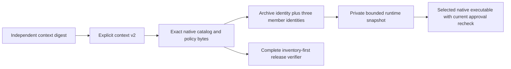

# ADR 0009: common runtime archives and explicit native tool members

Status: proposed, 2026-10-02; stakeholder review and production catalog
acceptance remain pending. Implementation is a separately reviewed migration.

Context: v1 locks identify tool distributions, while real cargo-cyclonedx
archives differ from the executed platform binary. V1 context checks require
distribution equality and every adapter pin on every selection. A single
native executable cannot be the identical runtime input for three platforms.

Decision: use an explicit outer context v2 and native catalog v2, preserving
v1 serialization and strict reader behavior. Keep archive digests in the lock,
bind executable members and target independently in v2 pins, and require
applicable baseline pins. Approve a common uncompressed canonical USTAR runtime
with exactly three native binaries; place its manifest outside the archive.
The private context authorizes bounded extraction of only the current host
runtime member after whole-archive and every-member checks. Consumer release
artifacts remain inert and are never unpacked or executed.

Alternatives: interpreting v1 distribution fields as executable bytes would
silently change frozen meaning. Per-target runtime identities would break
the common inventory input. Source-only runtimes cannot be executed by the
native consumer. Compressed or general-purpose archive extraction adds codec,
path/link and allocation surfaces to the bootstrap boundary. A proprietary
container avoids tar parsing but has no standard writer interoperability.

Consequences: runtime download cost includes three binaries (at most 384 MiB
plus record padding), with streaming 64 KiB buffers, private retained native
storage and explicit stage limits. Native catalog approval is a migration;
no automatic adoption of moving pins occurs. Unsafe containers, unsupported
hosts, wrong target bytes, missing baseline inputs and expired authorities
fail closed. No new Rust archive dependency or caller command/URL is exposed.

Security and failure limits: unprivileged hosted observations do not prove
source review, upstream authentication or signing authority. Header magic
checks do not replace approval of executable bytes. A trusted local account
and stable private filesystem are assumed. Catalog/root acceptance, qualified
platform reports and protected final-byte/pilot rehearsals remain separate.
See [the migration contract](../runtime-native-v2.md) for format, native evidence
and operational qualification boundaries.
