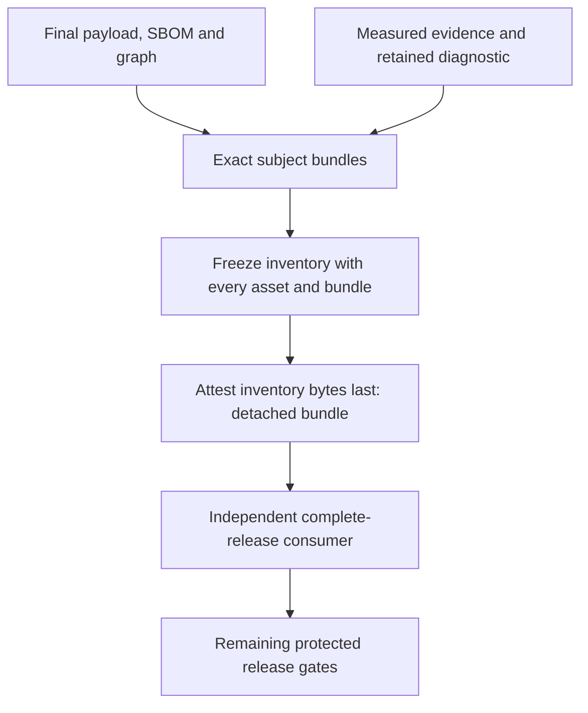

# Seal the cargo before you attest it

Candidate source: workflow integration
[`b2b9fbc9846d5aa4bf1dbdb8e8618bddad25e23c`](https://github.com/brianluby/armorer-workflows/tree/b2b9fbc9846d5aa4bf1dbdb8e8618bddad25e23c).
The embedded catalog still pins workflow main `772ca83e386c883c88cc3b936d69f8cb3216c91e`.
This internal assembler prepares a byte layout for the strict consumer. It
provides no main CLI command, signing adapter or publication operation.

Measure the transformation. Attest the bytes that remain. **This is the way.**

## Prepare the entire independently expected set

`prepare_final_payloads` takes complete v3 handoff directories and a
controller-owned `ReleaseExpectation`. The expectation binds source, config,
locks, runtime/catalog bytes, build and package workflows, run/attempt and every
selected package/binary/target/feature case. Its syntax establishes no approval.
Obtain those identities through the independent path described in
[producer evidence](candidate-producer-evidence.md).

Build and package must share the exact reviewed workflow-family commit. The
package workflow must equal the independently expected run workflow. Mixed pins,
foreign source/run/input identities or missing/extra selections fail before use.
Branch identities admitted for fixture assembly are not publication permission;
the release controller must enforce its separate source/ref/trigger gates.

The assembler snapshots all five regular handoff leaves, verifies the v3
envelope and retains the observed build interval. It measures package input and
output digests/sizes and wall-clock start/finish. Packaging must not predate the
observed build finish.

| Profile/target | Final payload | Transformation boundary |
| --- | --- | --- |
| Linux CLI/service | `<selection>.tar.gz` | Inspect the target's ELF64 machine header; archive exactly the declared binary as one regular USTAR member |
| Library on any supported target | `<selection>.crate` | Copy exact opaque source-package bytes; no inner extraction or Developer ID signing |
| macOS CLI/service | Blocked before staging | Protected Apple finalization is required; unsigned intake cannot satisfy it |

Linux archive headers fix member mode `0755`, uid/gid/timestamps to zero and
owner names to empty strings. The gzip header has no filename and timestamp zero.
Those normalized headers do not prove reproducible compiler output. The payload
is never executed, loaded or rebuilt by this assembler. ELF header acceptance
does not establish safe code, genuine provenance or complete binary validation.

The current limit is 64 selections and 4 GiB total staging, including unsigned
snapshots and later final metadata/bundles. Retained files are mode `0400` inside
private mode `0700` directories. They exist only within the context manager;
normal or exceptional exit removes staging. Every transition checks exact file
names, regular types and unchanged bytes. Stable filesystem ancestry and a
trusted local account remain assumptions.

Keep every selection. Reject the unsupported whole set. **This is the way.**

## Follow the fixed assembly order

Prepare payload, exact Cargo SBOM and selected Cargo graph first. Retain actual
platform diagnostic bytes and complete evidence matching measured build/package
inputs, outputs, timestamps and workflow/run identities. The fixed `.build.json`
and `.package.json` leaves contain the same complete two-step evidence record;
their names do not mean two independently authenticated observations occurred.
Both steps reference the retained diagnostic's exact byte identity.

The internal methods expose fixed local subject paths and derived attestation
slots. They accept no caller-chosen shell command, subject digest or predicate.
A future qualified signer must produce genuine bundles for those exact paths;
these method calls cannot obtain an attestation token or mint a private proof.

For each selection, the fixed inventory contains six subjects: final payload,
`.cdx.json`, `.cargo-graph.json`, `.build.json`, `.package.json` and
`.diagnostic.json`. It also contains six subject-provenance bundles and one SBOM
bundle targeting the final payload with the exact retained `.cdx.json` predicate.
That is **13 inventory assets per selection** in this layout.

`freeze_inventory` requires all selection metadata and every derived bundle.
It then writes `armorer-release-inventory.json`. Attest that inventory last and
retain `armorer-release-inventory.provenance.sigstore.json` outside its asset
list. Neither inventory nor its detached bundle appears within that list. This
avoids a self-referential digest cycle. The completed directory therefore has
`13 × selections + 2` files; a file count alone does not validate their contents.

No replacement, extra leaf or missing subject is accepted after inventory freeze.
The strict consumer must also bind each platform reference to its own selected
final artifact, as described in [candidate verification](candidate-verification.md).
The independently approved policy must explicitly admit the diagnostic as a
reporting supplemental asset; the assembler cannot add that policy decision.

Seal the inventory last. Keep its proof detached. **This is the way.**

## Earn authentication after layout completion

`add_bundle` checks bounded Sigstore/DSSE shape, one exact subject digest, expected
predicate type and the exact retained SBOM document. It does not verify signature
cryptography, issuer, source or signer. A structurally matching synthetic bundle
can reach `layout-complete-unverified`.

`finish` always leaves `cryptographic_release_authenticated`,
`signing_authorized` and `publication_authorized` false. `directory()` exposes
only the completed, rechecked inert layout for an independent consumer. That
consumer needs its own approved context, policy, roots and qualified tools and
must authenticate every required asset and relationship.

This candidate has no path that converts inspected unsigned Apple executable
bytes into accepted signed final bytes. Keep the complete selection blocked until
the protected Developer ID/notarization/package chain exists. A qualified Linux
or library subset cannot supply missing Apple parity or complete own-release
acceptance. Publication, owned draft retry, served-byte checks and pilots still
need their separately qualified adapters and evidence.

The preceding `e88e25fc46c1` [integration review](../reviews/2026-10-03-workflow-integration.md) records
19 passing local assembly tests, including exact byte transformations, inventory
ordering, mutation, limits, cleanup and synthetic layout completion. It also
retains the separate intake/policy/collector and hosted validation boundaries.
These are not a genuine signed own-release positive. Read the
[exact assembly contract](https://github.com/brianluby/armorer-workflows/blob/b2b9fbc9846d5aa4bf1dbdb8e8618bddad25e23c/docs/final-payload-v1.md)
before qualifying a controller.

Complete bytes first. Earn authentic proof next. **This is the way.**
