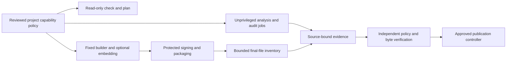

# Additional supply-chain defenses and adapters

Assessment for [Veans #16](https://kanban.luby.us/tasks/1319), verified 2026-10-01.
Status: proposed for review; assessment complete, adapters not implemented.
[ADR 0005](adr/0005-additional-defenses-and-adapters.md) records the decisions.
This assessment precedes the remaining trust-contract freeze in #2. Implementing
these optional capabilities does not block #2 or the v0.1 Build L2 baseline.

## Scope and current evidence

The baseline remains fixed-command Rust CI, project-owned dependency/license
policy, actionlint, zizmor, redacted Gitleaks, target Cargo CycloneDX SBOMs,
and the planned isolated attestations, strict verification and immutable drafts.
The workflow repository has CI and unsigned builders; release attestation,
Apple finalization and publication remain pending. This assessment changes no
runtime, credentials, settings or pilot repository. A signed artifact can still
contain vulnerable or malicious code. None of the tools below establishes a
SLSA level or closes the deferred L3 ticket.

Priorities order follow-ups after the baseline, not new mandatory release gates.
Effort estimates are engineering days for an adapter and fixtures, exclude human
dependency audits/subscriptions, and have roughly 50% uncertainty. All optional
profiles start disabled; a configured required capability must fail closed when
unsupported, unavailable, expired or incomplete. Do not turn failures into passes.

## Priority and operational cost

| Priority / capability | Threat addressed and limitation | Recommendation / integration cost | Recurring owner commitment |
| --- | --- | --- | --- |
| P1: CodeQL Rust + Actions | Source and workflow defects beyond Clippy/zizmor; coverage is query/extractor dependent | Opt-in analysis, initially reporting; promote selected findings to a reviewed gate after pilot triage. 2–3 days | Security owner reviews alerts weekly and every query/tool upgrade; workflow owner owns runner/permission fixtures |
| P1: cargo-auditable | Recover Rust dependency versions from installed executables; metadata can be omitted/tampered with by malicious build code | Opt-in builder variant for CLI/service, embed before signing; verify extraction from final bytes. 2–3 days | Builder owner tests section retention on each supported target, linker/strip/toolchain upgrade |
| P1: supplementary Syft/native inventory | Cargo SBOMs omit system/native/downloaded inputs; scanning cannot recover every statically linked or stripped component | Opt-in inventory for native-heavy deliverables; Cargo SBOM stays authoritative for its declared Cargo graph. 3–5 days | Inventory owner maintains cataloger scope, package identity mappings, platform fixtures and manual gap records |
| P2: cargo-vet | Malicious/unreviewed dependencies not covered by known-advisory scanning | Opt-in audit policy with reviewed imports and ratcheted exemptions; never auto-certify. 2–3 days integration, auditing separate | Dependency reviewer handles every graph change and periodically reviews imported trust/exemptions |
| P2: Linux egress controls | Unexpected build-time downloads/exfiltration | Observe first, then reviewed domain allowlist; paid/private and non-Linux limits explicit. 3–5 days | Workflow/security owner revalidates endpoints, telemetry/privacy and platform licensing on upgrades |
| P2: independent reproducibility | Detect disagreement between a release and a separately rebuilt object | Experimental comparison of unsigned executables/source archives first. 4–7 days | Build owner maintains deterministic inputs, independent rebuild environment and mismatch triage |
| P3: OpenSSF Scorecard | Discover repository governance/settings gaps | Scheduled diagnostic only, no aggregate-score release threshold. 1–2 days | Maintainer triages concrete checks monthly and after permission/ruleset changes |
| P3: dist adapter | Packaging/installers/target expansion without maintaining every format ourselves | Future bounded build/package adapter; Armorer retains release control. 4–6 day spike, production scope after spike | Adapter owner reviews each dist/tool/schema/template upgrade and installer verification behavior |
| P3: crates.io OIDC adapter | Remove standing publish tokens; prevent source-package substitution and unsafe retries | Future library publishing capability, separate from GitHub `.crate` distribution. 4–6 day spike, production scope after spike | Release owner maintains registry identity, ownership, byte-verification and partial-publication recovery fixtures |

Do not add a second default advisory scanner just to increase tool count. Grype,
OSV-Scanner or installed-binary `cargo audit` can be assessed with the native/
auditable adapter when they add coverage; record database identity/freshness and
avoid double counting the same advisory. Preserve the current Gitleaks gate:
its upstream now promises security patches only and points to Betterleaks.
Evaluate replacement detection/redaction/suppression compatibility through the
reviewed upgrade path rather than replacing it automatically. [Gitleaks status](https://github.com/gitleaks/gitleaks/blob/master/README.md).

## Capability and trust boundaries

| Capability | Public/private or platform prerequisite | If unavailable |
| --- | --- | --- |
| CodeQL | Public GitHub.com; organization repositories on supported plans with GitHub Code Security enabled. Do not presume support for a private personal repository or GHES Rust from GitHub.com documentation | Report eligibility, extractor/query version and coverage unknown/unsupported; block if required, otherwise show disabled/unavailable |
| cargo-vet / cargo-auditable / Syft | CLI tools can be used in private repositories; fetching audit imports/tool artifacts and exposing private crate names need project approval. Auditable supports Linux/macOS/Windows upstream, but Armorer must qualify its three native targets | No automatic external audit upload or SBOM publication; unsupported target fails its configured profile |
| Harden-Runner | Upstream Community supports public GitHub-hosted runners. Private or self-hosted requires Enterprise; current upstream describes macOS/Windows as audit-only, Linux as full support | No substitution of audit for blocking; detect missing agent/license/enforcement evidence, including success-with-no-monitoring behavior |
| Scorecard | API/check coverage and access depend on permissions/repository. Some protection checks can omit inaccessible settings | Missing access remains unknown; do not supply an admin credential to PR jobs merely to improve a score |
| Reproducibility | A known, reconstructible environment plus an independent rebuild | Record untested/not reproducible at specified scope; never infer from two checksums or a pinned compiler |
| dist / crates.io | Reviewed backend and supported registry/publisher setup; outside current v0.1 adapters | Discovery can report prerequisites; no execution or fallback to a standing token during check/plan |

[CodeQL eligibility](https://docs.github.com/en/code-security/concepts/code-scanning/codeql/codeql-code-scanning),
[Harden-Runner tiers and compatibility](https://github.com/step-security/harden-runner#features-and-pricing-tiers),
and [Scorecard check limitations](https://github.com/ossf/scorecard/blob/main/docs/checks.md)
are upstream capability descriptions, not hosted proof that Armorer has enabled them.

### CodeQL

Current GitHub documentation lists `rust` and `actions`. Rust supports `none`
build mode, but rust-analyzer still runs `build.rs` and compiles macro code. It
belongs in an ephemeral unprivileged analysis job; never invoke it in check/plan,
signing, attestation or publication jobs. Avoid release output caches. Keep
source analysis separate from bounded SARIF upload; uploading is not permission
to run repository code with a write token. Qualify the actual fork/Dependabot
upload behavior before promising a required check. Pin action SHA, CLI bundle,
query packs and query configuration through a reviewed catalog; record which
files/features were analyzed and extraction failures. Generated/native code
coverage is a tested limitation, not assumed complete. [Rust analysis behavior](https://docs.github.com/en/code-security/reference/code-scanning/codeql/build-options-for-compiled-languages),
[language identifiers](https://docs.github.com/en/code-security/reference/code-scanning/workflow-configuration-options).

### Audits and inventories

cargo-vet records local/imported audits, criteria mappings, publisher trust and
version exemptions. Keep its store in version control and use locked CI, with
reviewed imported data. Armorer must separately enforce owner/reason/review-date/
expiry for exemptions because upstream exemptions are not an expiry mechanism.
Report locally audited, imported, publisher-trusted, exempt and uncovered counts
separately. Vetting is a maintainer judgment and does not certify safety.
[Cargo Vet configuration](https://mozilla.github.io/cargo-vet/config.html),
[CI](https://mozilla.github.io/cargo-vet/configuring-ci.html).

cargo-auditable embeds dependency JSON in the executable's `.dep-v0` section.
Build selection remains Armorer-derived; its generic argument forwarding is not
a caller interface. Use stable Rust first; the upstream nightly SBOM precursor
mode is not a baseline requirement. Strip/package/sign fixtures must demonstrate
that final binaries retain readable metadata. Compare recovered crates to the
expected graph with explicitly tested treatment of build dependencies and
feature unification; do not assert identical graphs without qualification.
It neither prevents a malicious build from lying nor identifies all statically
linked C libraries. [cargo-auditable capabilities and limits](https://github.com/rust-secure-code/cargo-auditable).

Syft supports filesystems, archives, images and multiple SBOM formats. Scan a
bounded, validated package/extraction tree, not the whole runner; native/system
build inputs need an independently recorded source/package inventory. Record
cataloger versions, scan source digest, scope and omissions. Reconcile duplicate
identities deliberately; a supplementary document must not silently overwrite
Cargo-aware evidence. Scope a later vulnerability scanner to those added
components. [Syft](https://github.com/anchore/syft/blob/main/README.md).

### Egress, repository diagnostics and reproducibility

A domain allowlist can reduce outbound paths but does not prove a dependency is
benign, control malicious uploads to permitted hosts or make hosted runners
hermetic. Capture endpoints in rehearsal, review them, test denial with a fake
blocked endpoint and explicit allowed downloads, then enforce on qualified Linux
jobs. Audit-mode observations are not blocking evidence. Upstream's service-fed
global block list can change independently of the pinned action: record that
mutable dependency. Review external telemetry before private adoption and retain
redacted evidence. Apple network services require a separate macOS design; do
not claim Linux block policy applies there. [Harden-Runner behavior](https://github.com/step-security/harden-runner#environment-compatibility-matrix).

Scorecard is a source of actionable checks with documented false negatives and
permission caveats. Store check results and inaccessible settings, never a score
as artifact identity or release readiness. Existing ruleset/capability checks
remain the authoritative release gate. [Scorecard checks](https://github.com/ossf/scorecard/blob/main/docs/checks.md).

Reproducibility means identical specified outputs given declared source,
instructions and environment. Control timestamps, paths, archives, toolchain,
native linker/sysroot and downloaded inputs; use `SOURCE_DATE_EPOCH` only where
the tool supports it. Two jobs sharing the same compromised tools provide weak
independence. Start with separately reconstructed unsigned Linux binaries and
`.crate` archives, retaining both digests and an explanation of mismatches.
Apple secure timestamps, notarization and final packaging need distinct evidence;
matching an unsigned object does not establish reproducibility of final signed
bytes. This work stays separate from L3. [Definition](https://reproducible-builds.org/docs/definition/),
[SOURCE_DATE_EPOCH](https://reproducible-builds.org/docs/source-date-epoch/).

## dist decision: bounded adapter later

The examined upstream is axodotdev/cargo-dist; its release list currently shows
0.33.0. This is a research candidate, not an authenticated Armorer tool pin.
Dist offers local/global artifacts, installers, custom jobs, runner/action
configuration, and optional GitHub attestations. Attestations default to the
local-build phase when enabled; later phases are configurable. Phase support
alone does not establish coverage of our final signed/notarized bytes.
[Release](https://github.com/axodotdev/cargo-dist/releases/tag/v0.33.0),
[configuration](https://axodotdev.github.io/cargo-dist/book/reference/config.html),
[attestation phases](https://axodotdev.github.io/cargo-dist/book/supplychain-security/attestations/github.html).

Retain current native builders for v0.1. A spike may qualify a fixed build-only
invocation using adapter-generated configuration and an explicit package/binary/
target/feature mapping. Validate or reject every effective dist/Cargo config
source: no caller extra-artifact commands, custom jobs, installers that execute
unverified downloads, arbitrary runners, tool pins or claimed source identities.
Disable backend publishing and attestation; Armorer retains final-byte signing,
inventory, predicates, draft assembly, concurrency, credentials and verification.
Do not run `dist init` over consuming workflows. A dist manifest is untrusted
adapter output, not our expected inventory. Reject unexpected files or selection
changes before handoff. If dist cannot provide that bounded interface, leave it
unsupported rather than opening a shell/custom-provenance escape hatch.

Installer support is a separate review: the installer and every payload it
fetches need exact version/source/signer verification before execution. Existing
checksum/attestation support is not evidence that an installer enforces our
consumer policy. Qualification requires custom-command rejection, unauthorized
trigger rejection, unsigned-versus-final byte substitution, extra asset,
selection drift and retry-conflict tests, plus protected Apple rehearsal.

## crates.io decision: future isolated registry publisher

Trusted publishing supports GitHub OIDC, 30-minute temporary tokens and optional
required environment matching. Current documentation requires an already
published crate and owner access: first publication still needs separately
managed API-token setup. Armorer reports that prerequisite; it never requests,
prints or provisions the token. Prefer trusted-publishing-only enforcement after
an owner-approved transition. Unsafe `pull_request_target` and `workflow_run`
triggers are blocked upstream; Armorer's allowed triggers remain narrower.
[Registry documentation source](https://github.com/rust-lang/crates.io/blob/a8b65a92154cd737b48abe84136e19156bcfefd2/svelte/src/routes/docs/trusted-publishing/+page.svelte),
[trusted-publishing enhancements](https://blog.rust-lang.org/2026/01/21/crates-io-development-update/),
[auth action](https://github.com/rust-lang/crates-io-auth-action).

At the inspected registry commit, exchange checks repository name/owner ID,
caller `workflow_ref` filename and configured environment. It does not pin the
reusable `job_workflow_sha`. Protect the consumer caller workflow and environment
and independently enforce the reviewed reusable workflow/source identity. A
repository rename/transfer or owner-ID change requires reviewed revalidation.
OIDC authorizes publishing; it does not attest the `.crate` bytes. GitHub also
has legacy and newer immutable subject formats; never parse identity by assuming
one `sub` string format. Hosted qualification of the actual cross-repository
caller/environment remains a prerequisite, not an outcome of this assessment.
[Registry exchange code](https://github.com/rust-lang/crates.io/blob/a8b65a92154cd737b48abe84136e19156bcfefd2/src/controllers/trustpub/tokens/exchange/mod.rs),
[GitHub claims](https://docs.github.com/en/actions/reference/security/oidc).

### Exact bytes and retries

Cargo `publish` packages again, uploads, then polls the index; a polling timeout
does not undo the upload. Cargo 1.95.0 help and current documentation support
workspace selection. This is not an atomic workspace transaction or exact-file
upload API. The pinned adapter must demonstrate byte behavior; calling ordinary
`cargo publish` after attesting a prior package cannot be presumed safe.
[Cargo publish](https://doc.rust-lang.org/cargo/commands/cargo-publish.html).

The future publisher must follow this protocol:

1. Derive an explicit crate/version dependency DAG from reviewed metadata. Reject
   cycles, missing external dependencies, unsupported registries and unselected
   package publication; `publish = false` is not overridden. Unpublished selected
   workspace dependencies require qualified staging/package verification;
   otherwise report unsupported before granting credentials. Reject ambiguous
   multiple target/feature-specific `.crate` objects for one registry name/version.
2. Create/verify packages in an unprivileged job. Cargo normalizes manifests and
   verifies by rebuilding; package VCS metadata is best effort, not source proof.
   Bind each approved archive's SHA-256/size to source/config/lock, package content
   evidence and test results before granting OIDC. [Cargo package](https://doc.rust-lang.org/cargo/commands/cargo-package.html).
3. Use an isolated protected publisher that executes pinned trusted helpers only,
   with no Cargo verification/build scripts or caller hooks under credentials.
   Either qualify deterministic repackaging and compare the actual upload object
   to the approved bytes before transmission, or implement a reviewed fixed
   registry upload transport for the already verified file. No arbitrary upload
   endpoint or metadata claims. This feasibility gate is unresolved; no supported
   adapter is claimed until demonstrated. Revoke temporary tokens on completion
   and never transfer them across jobs/artifacts.
4. Serialize the publication set; record each crate/version separately as
   prepared, uploaded, registry-observed or registry-bytes-verified. After upload
   download the exact registry `.crate` and compare it with approved SHA-256/size
   and the index `cksum`. Bound redirects/hosts, response sizes and polling; do
   not execute downloaded code. A registry checksum proves byte consistency,
   not our signer/source. [Index checksum](https://doc.rust-lang.org/cargo/reference/registry-index.html).
5. On ambiguous timeout or retry, query that exact version before another upload.
   Identical already-published bytes resume verification; different bytes,
   ownership or publish-set identity stop as conflicts. Index/CDN lag leaves a
   recoverable pending state, not automatic success. Publish dependent crates
   only after prerequisites are registry-visible and byte-verified. No `--clobber`,
   automatic yanking or new-version selection; there is no multi-crate rollback.
6. If a later crate fails, keep receipts for completed versions and resume only
   the same approved publish set. Freeze any repackaging that changes with newly
   available workspace versions: changed bytes require a new review. Decide the
   GitHub-versus-registry publication order explicitly; no atomic cross-service
   release exists. Do not promote moving tags while required channels are pending.

Tests must cover first-publish prerequisites, wrong caller/reusable workflow,
wrong environment/owner/registry, token denial/expiry/revocation, forbidden
triggers, tampered upload/download, repackaging changes, name/version collisions,
partial DAG completion, index lag, unknown upload result and conflicting retry.
Registry tests initially use a local mock and no-production-upload rehearsal;
staging/production publication requires separate authorization.

## Inputs to the #2 contract freeze

These are required design decisions for #2; they do not add supported fields to
the current experimental schemas. Keep strict unknown-field rejection until a
versioned implementation exists.

| Contract | Required boundary |
| --- | --- |
| Configuration/catalog | Enumerated capability IDs and reviewed compatible adapters; explicit disabled/reporting/required policy. No raw commands, caller URLs, custom predicates or arbitrary tools. Exact action/helper/tool/query/schema pins with authenticated upgrade path |
| Independent verification policy | Expected predicates, signer/source/workflow identities, required evidence kinds and scope; optional evidence cannot satisfy missing baseline proof. Disabled historical optional controls do not weaken required attestations |
| Inventory | Explicit artifact roles: primary Cargo SBOM, supplementary native SBOM, embedded metadata report, diagnostics and transformation/rebuild records. Bind hashes/sizes and subject relationships; derive required asset set independently, avoid self-referential hashes |
| Per-artifact evidence | Source/config/lock/runtime/run/attempt, tool/database/query/policy identities, timestamp/freshness, target/features, tested coverage/omissions, result and exception references. Distinguish skipped/unsupported/unknown/error/reporting/enforced; producer records remain L2 evidence |
| Publication receipts | Separate GitHub and registry lifecycle, approved publish-set identity, per-crate version/digest/DAG and byte-verification observations. Do not overload configured/CI-verified/rehearsed/published/provenance-verified with a scanner pass |

## Exception and maintenance policy

Existing CI remains strict and does not gain arbitrary scanner suppressions.
Future exceptions require a separate typed reviewed record: tool/rule/version,
subject or path bound to source, owner, rationale, evidence, expiry and maximum
scope. Positive controls must still detect an adjacent real defect. Never waive
wrong source/signer/predicate, exact-byte mismatch, unauthorized trigger or
credential boundary. New cargo-vet exemptions are explicit missing audits;
CodeQL dismissals need an independent reviewed record; scanner DB outages are
unknown/error, not false positives. Native identity ambiguities are coverage
gaps, not silently filtered matches. Review licenses with project policy rather
than inferring it from Armorer's MIT license.

Before any default promotion: designate an owner, qualify public/private and all
supported targets, demonstrate effective required-check enforcement, benchmark
runtime/cost and failure/false-positive rate, rehearse outage/expiry/upgrade/
recovery, and document redaction, retention, support and removal. Record
measured costs in the pilot; these estimates are not benchmarks. Security fixes
trigger prompt reviewed catalog updates; review candidates monthly and recheck
upstream capability/licensing on every adapter promotion. Use least-privilege
jobs; external service integration is opt-in and must disclose data sent.

## Reviewable follow-ups

Keep these unscheduled and outside v0.1 release acceptance unless separately
selected. They depend on reviewed contracts/baseline capabilities, not the
reverse. Security owner owns policy/criteria; workflow owner owns fixed jobs;
builder/inventory owner owns byte scope; release owner owns publication state.
The coordinator owns shared schema/catalog changes and final integration.

| Slice | Acceptance before enabling |
| --- | --- |
| [#17: CodeQL Rust/Actions](https://kanban.luby.us/tasks/1334) | Eligible/ineligible/fork cases; source-bound version/coverage evidence; build-script sentinel proves unprivileged boundary; reviewed false-positive controls |
| [#18: Auditable binaries + supplementary native inventory](https://kanban.luby.us/tasks/1335) | Three native target fixtures; final extraction after strip/sign/package; Cargo/native scope distinction; tampered/missing metadata and SBOM rejection |
| [#19: cargo-vet adoption](https://kanban.luby.us/tasks/1336) | Reviewed import/criteria/store; audit vs exemption counts; dependency upgrade gap, expired exception and unavailable import tests; no auto-created audits |
| [#20: Linux egress qualification](https://kanban.luby.us/tasks/1337) | Effective agent/entitlement proof, allowed/denied endpoint controls, private telemetry review, audit versus block distinction and explicit macOS limitation |
| [#21: Independent rebuild experiment](https://kanban.luby.us/tasks/1338) | Source/environment binding, independent unsigned comparison, intentional nondeterminism test and mismatch triage; no final-byte Apple or L3 overclaim |
| [#22: Scorecard diagnostics](https://kanban.luby.us/tasks/1339) | Scoped read-only scheduled run, inaccessible-settings fixture, actionable check reports and no score-derived release gate |
| [#23: dist feasibility spike](https://kanban.luby.us/tasks/1340) | Trusted generated configuration rejects hooks/runners/publishing; target/feature/exact-asset mapping; no-publish native rehearsal and installer verification decision |
| [#24: crates.io feasibility spike](https://kanban.luby.us/tasks/1341) | Exact upload-object proof, protected caller/environment OIDC qualification, downloaded bytes/index verification and all partial-DAG/retry cases above |

## Verification record

Primary documentation and the registry source at
`a8b65a92154cd737b48abe84136e19156bcfefd2` were inspected read-only.
Cargo 1.95.0 `publish --help` was checked locally without building or uploading.
Existing CI/build boundaries were inspected at Armorer
`d0e2fbcbba9bd79d96e4a1ed02de4f54362b6695` and armorer-workflows
`772ca83e386c883c88cc3b936d69f8cb3216c91e`. No optional adapter was installed or
rehearsed; candidates are not authenticated pins. Hosted eligibility, telemetry,
repackaging/upload and target-retention behavior remain implementation gates.
